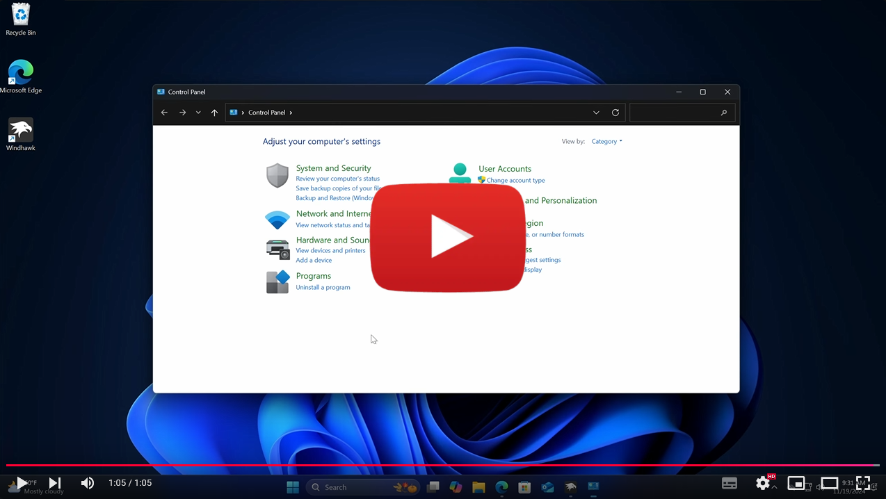

# Rectify11 Resource Redirect

The resource pack of Rectify11 for Windhawk's Resource Redirect mod.

## Table of contents

* [Introduction](#introduction)
* [Features](#features)
* [Installation](#installation)
* [Contributing](#contributing)
* [Credits](#credits)
* [Screenshots](#screenshots)

## Introduction

This is the collection of the much requested [Rectify11](https://rectify11.net/home) port for Windhawk's [Resource Redirect](https://windhawk.net/mods/icon-resource-redirect) mod. Rectify11 is a tool that allows you to customize your Windows 11 experience and make it more consistent by modifying system files. The advantage of using this resource pack is the instant activation or deactivation of the loading of Rectify11 resources, all in memory without the requirement of modifying system files. This results in future Windows system updates not changing the resources loaded by the Resources Redirect mod, which otherwise patching the system files would have. Not all of the components of Rectify11 are included in this resource pack as they are not supported by this mod, such as custom Windows themes, cursors, wallpapers, system fonts and third-party software packages and they require the official installer.

> [!NOTE]
> The Redirect Redirect mod works with many types of resources listed [here](https://windhawk.net/mods/icon-resource-redirect).

## Features

This pack adds/modifies:
* [System icons](#redesigned-system-icons)
* [Windows UI](#refined-ui) most notably in:
  * File Explorer
  * Task Manager
  * WMP Legacy
* [DirectUI animations](#added-directui-animations) most notably in:
  * File Explorer
  * Task Manager
* [GDI text alpha fix](#translucent-file-explorer-partial-fix-of-text-alpha-values) on File Explorer (partially)  
*(this is visible for people who have translucent windows by enabling [DwmExtendFrameIntoClientArea](https://learn.microsoft.com/en-us/windows/win32/api/dwmapi/nf-dwmapi-dwmextendframeintoclientarea) using [MicaForEveryone](https://github.com/MicaForEveryone/MicaForEveryone) and having one of these enabled: HDR, 10-bit colors, light mode or white background behind the window)*

## Installation
If you're not familiar with Windhawk, here are the steps for installing the mod:

* Download Windhawk from [windhawk.net](https://windhawk.net/) and install it.
* Go to "Mods" in the upper right menu.
* Find and install the "Resource Redirect" mod.

### R11 pack installation

* Download your R11 pack through the [resources folder](Resources/WindhawkR11.7z).
* Unzip and extract the theme folder in a directory of your system.
* First run as admin the `CopyNecessary.bat` script.
* Copy the path of the theme folder (right click - copy as path) which contains the theme files.
* Open Windhawk, go to the already installed "Resource Redirect" mod.
* Go to mod's settings tab.
* Paste the copied path to the theme folder empty box and remove the path quote marks.
* Enable "Redirect all loaded resources" option.
* Click Save.

> [!TIP]
> For a cleaner look of folders, use [the script to disable folder thumbnail previews](Scripts/Disable_folder_thumbnail_previews.bat).

> [!NOTE]
> The contents of Rectify11 resource pack are equivalent to the "System icons" option in the official installer

> [!Important]
> Rectify11 Resource Redirect works best with the Rectify11 Windows themes.  
> In case of any visual inconsistencies in the UI of Windows, use the Rectify11 installer  
> from the official [website](https://rectify11.net/home) to install the custom themes
> 
> 

> [!CAUTION]
> Don't move the theme files or change their filenames unless you know how the theme redirection works!

### Installation Demo

*Click on the image to view the demo video on YouTube.*

## Contributing

If you have additional resources fitting the Rectify11 design that you would
like to share, please submit a [pull request](https://github.com/ramensoftware/R11-resource-redirect/pulls).

### Issues
If you are experiencing issues with this mod, please [open an issue](https://github.com/ramensoftware/R11-resource-redirect/issues).

## Credits
* The Rectify11 dev team.
* [marbles0976](https://discord.com/users/716028609973977110) for the Windhawk icon.

If you like the Rectify11 pack please follow the [Rectify11 Github repository](https://github.com/Rectify11/Installer).

## Screenshots
### Redesigned system icons
**Default**

**Rectify11**

### Refined UI
**Default**

**Rectify11**

### Added DirectUI animations
**Default**

**Rectify11**

**Default**

**Rectify11**

### Translucent File Explorer partial fix of text alpha values
**Default**

**Rectify11**

